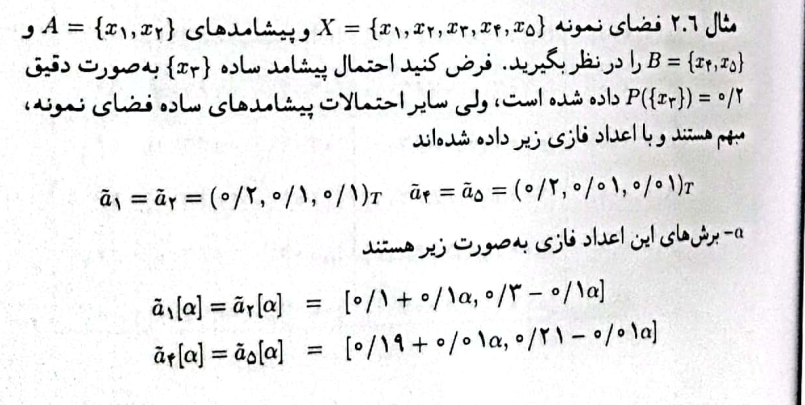
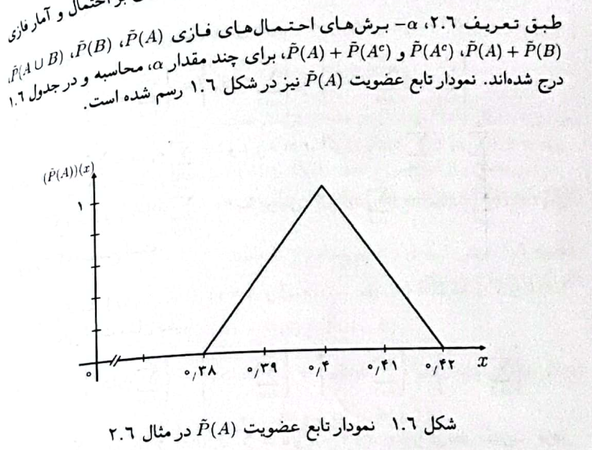
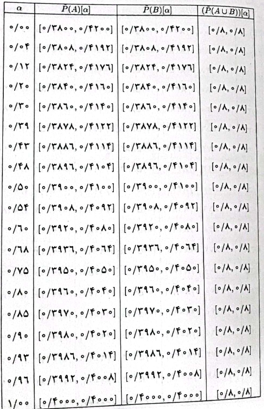
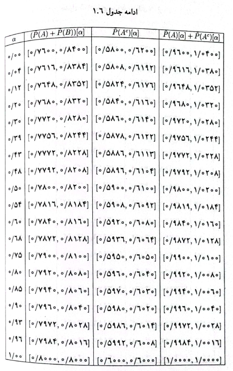
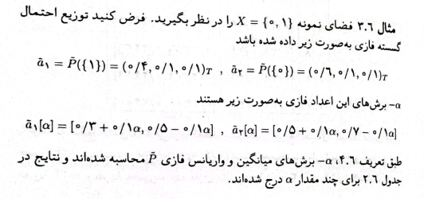
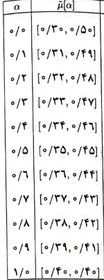
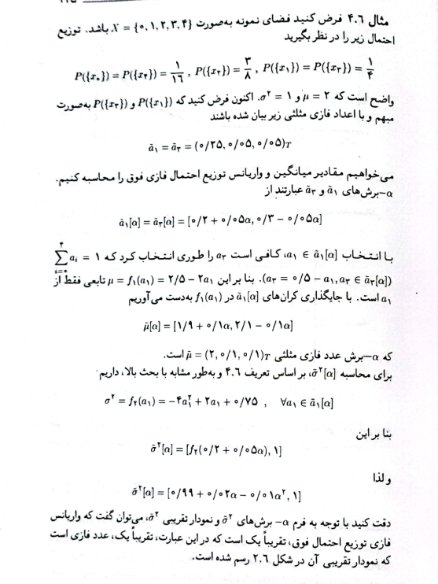

## Example 2.6
```{r , echo=FALSE,out.width = '50%'}



```


## Solve of example 2.6
\tiny
```{r , warning=FALSE}

a1 = c(0.2 , 0.1 , 0.1)
a2 = c(0.2 , 0.1 , 0.1)
a4 = c(0.2 , 0.01 , 0.01)
a5 = c(0.2 , 0.01 , 0.01)


alpha_boresh = function(a , alpha)
{
  return( c(lower = a[1] - a[2] + (a[2]*alpha) , upper = a[1] + a[2] - (a[2]*alpha)) )
}
alpha = c(0 , 0.04 , 0.12 , 0.2 , 0.3 , 0.43 ,
          0.48 , 0.5 , 0.54 , 0.6 , 0.68 , 0.75 ,
          0.8 , 0.85 , 0.9 , 0.93 , 0.96 , 1)

alpha_boresh_a1_lower = c()
alpha_boresh_a1_upper = c()
alpha_boresh_a2_lower = c()
alpha_boresh_a2_upper = c()
alpha_boresh_a4_lower = c()
alpha_boresh_a4_upper = c()
alpha_boresh_a5_lower = c()
alpha_boresh_a5_upper = c()

```

\normalsize

## Solve of example 2.6
\footnotesize

```{r ,warning=FALSE}
for(i in 1:length(alpha))
{
  alpha_boresh_a1_lower[i] =  alpha_boresh(a1 , alpha[i])[1]
  alpha_boresh_a2_lower[i] =  alpha_boresh(a2 , alpha[i])[1]
  alpha_boresh_a4_lower[i] =  alpha_boresh(a4 , alpha[i])[1]
  alpha_boresh_a5_lower[i] =  alpha_boresh(a5 , alpha[i])[1]
  alpha_boresh_a1_upper[i] =  alpha_boresh(a1 , alpha[i])[2]
  alpha_boresh_a2_upper[i] =  alpha_boresh(a2 , alpha[i])[2]
  alpha_boresh_a4_upper[i] =  alpha_boresh(a4 , alpha[i])[2]
  alpha_boresh_a5_upper[i] =  alpha_boresh(a5 , alpha[i])[2]
}
```
\normalsize

## Solve of example 2.6
\tiny
```{r , warning=FALSE}
library(tidyverse)
alpha_boresh_table = tibble(alpha_boresh_a1_lower , alpha_boresh_a1_upper ,
       alpha_boresh_a2_lower , alpha_boresh_a2_upper , 
       alpha_boresh_a4_lower , alpha_boresh_a4_upper ,
       alpha_boresh_a5_lower , alpha_boresh_a5_upper)
alpha_boresh_table
```
\normalsize

## Solve of example 2.6
\tiny

```{r , warning=FALSE}
p_alpha = function(a , alpha)
{
  return(c(max = max(alpha_boresh(a , alpha)),
  min = min(alpha_boresh(a , alpha))))
}

p_alpha(a1 , 1)
p1_alpha_max = c()
p2_alpha_max = c()
p4_alpha_max = c()
p5_alpha_max = c()
p1_alpha_min = c()
p2_alpha_min = c()
p4_alpha_min = c()
p5_alpha_min = c()
for( i in 1 : length(alpha))
{
p1_alpha_max[i] = p_alpha(a1 , alpha[i])[1]
p2_alpha_max[i] = p_alpha(a2 , alpha[i])[1]
p3_alpha = 0.2
p4_alpha_max[i] = p_alpha(a4 , alpha[i])[1]
p5_alpha_max[i] = p_alpha(a5 , alpha[i])[1]
p1_alpha_min[i] = p_alpha(a1 , alpha[i])[2]
p2_alpha_min[i] = p_alpha(a2 , alpha[i])[2]
p4_alpha_min[i] = p_alpha(a4 , alpha[i])[2]
p5_alpha_min[i] = p_alpha(a5 , alpha[i])[2]
}

p_alpha_table = tibble(p1_alpha_min , p1_alpha_max , 
                       p2_alpha_min , p2_alpha_max ,
                       p4_alpha_min , p4_alpha_max ,
                       p5_alpha_min , p5_alpha_max)
```
\normalsize

## Solve of example 2.6
\tiny
```{r , warning=FALSE}

p_alpha_table

```
\normalsize

## solve of example 2.6

```{r , echo=FALSE,out.width = '100%'}

```


## Solve of example 2.6
```{r , warning=FALSE}
library(tibble)
Prob_A_alpha = function(alpha){
  
  return(prob_A_alpha = c( lower = 1 - p3_alpha - (p4_alpha_max + p5_alpha_max ) ,
                           upper = 1 - p3_alpha - (p4_alpha_min + p5_alpha_min)))}

Prob_A_alpha_table = tibble(Prob_A_alpha_min = Prob_A_alpha(alpha)[1:18] ,Prob_A_alpha_max = Prob_A_alpha(alpha)[19:36])
Prob_A_alpha_table
Prob_Ac_alpha_max = 1 - Prob_A_alpha(alpha)[1:18]
Prob_Ac_alpha_min = 1 - Prob_A_alpha(alpha)[19:36]

Prob_Ac_alpha_table = tibble(Prob_Ac_alpha_min , Prob_Ac_alpha_max)

```

## Solve of example 2.6
\tiny
```{r , warning=FALSE}
(Prob_A_Ac_alpha = tibble(prob_A_Ac_alpha = Prob_Ac_alpha_table + Prob_A_alpha_table))
```

## solve of example 2.6

```{r , echo=FALSE,out.width = '50%' , out.height="75%"}

```

\normalsize

## Example 3.6
```{r , echo=FALSE,out.width = '100%'}

```

## Solve of example 3.6
\tiny
```{r , warning=FALSE}
library(tidyverse)
a1 = c(0.4 , 0.1 , 0.1)
a2 = c(0.6, 0.1 , 0.1)
alpha_boresh = function(a , alpha)
{return( c(lower = a[1] - a[2] + (a[2]*alpha) , upper = a[1] + a[2] - (a[2]*alpha)))}
p_alpha = function(a , alpha){
  return(c(min = min(alpha_boresh(a , alpha)),
           max = max(alpha_boresh(a , alpha))))}
alpha = c(0,0.1,0.2,0.3,0.4,0.5,0.6,0.7,0.8,0.9,1)
mu_min = c()
mu_max = c()
for(i in 1:length(alpha)){
  mu_min[i] =  (p_alpha(a1 , alpha[i])[1] * 1) + (p_alpha(a2, alpha[i] )[1] * 0)
  mu_max[i] =  (p_alpha(a1 , alpha[i])[2] * 1) + (p_alpha(a2, alpha[i] )[2] * 0)
}
```
\normalsize


## Solve of example 3.6
\tiny
```{r , echo=FALSE,out.width = '25%' , out.height= "30%"}
(mu_table = tibble(mu_min , mu_max))

```

## Example 4.6

```{r , echo=FALSE,out.width = '85%' , out.height= "75%"}

```

## Solve of example 4.6
\tiny
```{r , warning=FALSE}
p0 = 1/16
p4 = 1/16
p2 = 3/8
mu_alpha  = function(alpha){
  
  return(c(lower = 1.9 + (0.1 * alpha) , 
         upper = 2.1 - (0.1 * alpha)))
}
mu_alpha(alpha)
(mu_table = tibble(mu_min = mu_alpha(alpha)[1:11] , mu_max = mu_alpha(alpha)[12:22]))
```
\normalsize

## Solve of example 4.6
\tiny
```{r ,warning=FALSE}
var_alpha = function(alpha){
  
  return(c(lower = 0.99 + 0.02 * alpha , 
         upper = 1))
}
var_alpha(alpha)
(var_table = tibble(var_min = var_alpha(alpha)[1:11] , var_max = 1))
```
\normalsize


