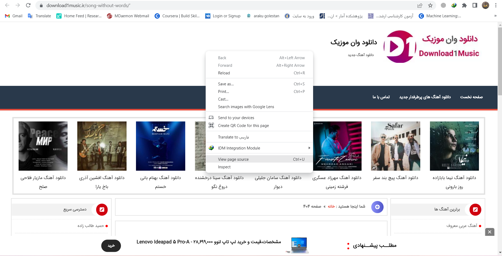
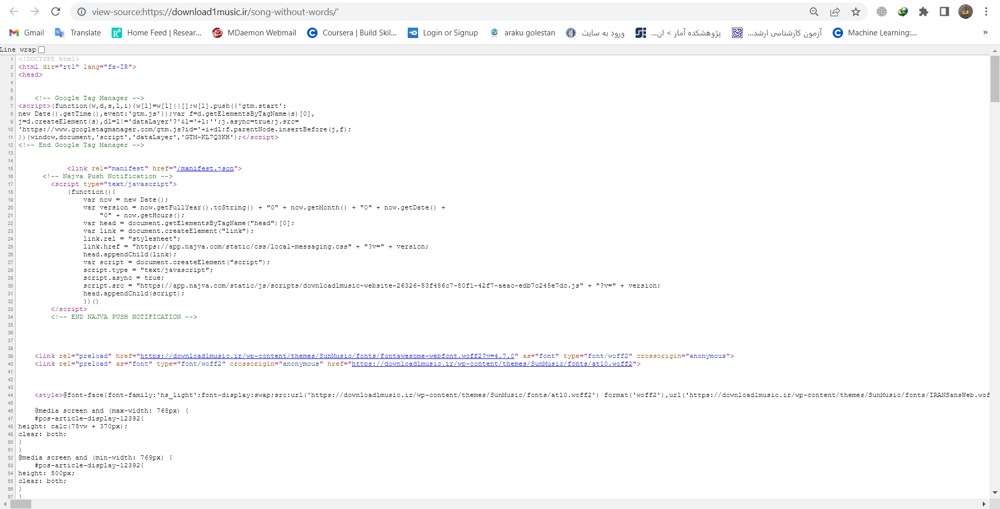
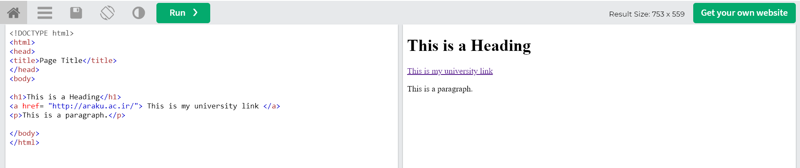

## Introduction to Web Mining

What is \textcolor{blue}{Web Mining?}\newline
Web Mining is a process based on \textcolor{blue}{data mining techniques} in which information is \textcolor{blue}{extracted from documents, Internet services}. The main purpose of web mining can be to discover useful information from the World Wide Web and its usage patterns.

## Introduction to Web Scraping

what is \textcolor{blue}{Web Scraping?}\newline
Web Scraping is the process of using bots \textcolor{blue}{to extract content and data from a website}.\newline
In addition to content, web scraping can also extract \textcolor{purple}{HTML code elements and publish that information wherever needed}.

## Html source

each website all over the world have a html source that we can see that.
for example we open a site with \textcolor{pink}{`https://download1music.ir/song-without-words/`}
address.
and we want to see this site html sorce.\newline
for recive the html source of sites we should right click on a website and select a \textcolor{purple}{View page source} or push \textcolor{purple}{ctrl + U} ( in google chorome browser).

## Html source 


```{r , echo=FALSE, fig.cap="how to open view page source of site with right click", out.width = '100%'}

```


## Html source

```{r , echo=FALSE, fig.cap="a source page of site", out.width = '100%'}

```

## Whats our purpose?

We want to automatic download all musics of bottom address with using R language. \textcolor{pink}{`https://download1music.ir/song-without-words/`}\newline
so at the first we should install some packages in R.

### Needed Packages:

- rvest
- tidyverse
- stringi

### Installing

```{r  ,warning=FALSE}
#install.packages("rvest")
#install.packages("tidyverse")
#install.packages("stringi")

```


## Start Web Scraping:

we should library needed packages after installing them.

### library Packages
\tiny
```{r  ,warning=FALSE}
library(rvest)
library(tidyverse)
library(stringi)
```
\normalsize

## Web Scraping 
at the first we should give URL of site to R.

```{r , warning=FALSE}
URL <- "https://download1music.ir/song-without-words/"
```

now we should read html source of url with \textcolor{blue}{read\_html} function.

```{r ,warning=FALSE}
pg <- read_html(URL)
```


## Web Scraping 
\tiny
Now we want to see \textcolor{purple}{pg}:
```{r , warning=FALSE}
pg
```
\normalsize

## Web Scraping 
Now we should find nodes that are starting with \textcolor{blue}{a} tag in Html source codes. for do this we need to use \textcolor{blue}{html\_nodes} function that the first arg should be a html of a link and the second is tagged that we want to find that.
\tiny
```{r ,warning=FALSE}
u1 = html_nodes(pg, "a")
head(u1)
```
\normalsize

## Web Scraping 
Now we want to find a files that refrenced by \textcolor{blue}{"href" taged} in \textcolor{purple}{a tag of html source}. for do it we need to use \textcolor{blue}{html\_attr} function. that the first arg is our nodes and the second arg is sth that we need to find that.
\tiny
```{r , warning=FALSE}

u2 = html_attr(html_nodes(pg, "a"), "href")
#u2 = html_attr(u1, "href")
head(u2)
```
\normalsize

## Whats a Tag and href in HTML?
if you pay attention to bottom picture you can understand whats a tag and href?\newline
its a tag that will hyper refrence youre text to a link that if you click on that new webpage will be open for you.

```{r , echo=FALSE, fig.cap="html codes that include a tag with href.", out.width = '100%'}

```


## Web Scraping 

So now we can make a tibble :
\tiny
```{r , warning=FALSE}
links <- tibble(url=html_attr(html_nodes(pg, "a"), "href"))
head(links)
```
\normalsize

## Web Scraping 
Now we want to filter our data (links tibble) that at the 4 string of url is equal to ".mp3" or its as a mp3 file. the \textcolor{blue}{str\_sub} function is selecting each url and the \textcolor{blue}{distinct} function will be uniqe our data ( with out any repeat!).
\tiny
```{r , warning=FALSE}
links <- links %>%
  filter(str_sub(url, -4) == ".mp3") %>% 
  distinct()
print(links)
```
\normalsize

## Web Scraping 

Now we want to select the file name from url (first column of links tibble).\newline
for do this we should use \textcolor{blue}{stri\_sub} function that the first arg is data and the second arg is a index that we start from that to end of string. \newline
the \textcolor{blue}{stri\_locate\_last} function is selecting the last `Slash` of url and +1 is the next character after last `Slash`. \newline
so here we are making a new column as file_name in links tibble that shows the name of each file.

\tiny
```{r , warning= FALSE}
links$file_name <- stri_sub(links$url, from = (stri_locate_last(links$url, fixed="/")[,1]+1))
```
\normalsize

## Web Scraping
Now we want to see the links tibble columns here:
\tiny 
```{r , warning=FALSE}
links[1:6 , 1]
links[1:6 , 2]
```
\normalsize

## Web Scraping 
Now we want to downlod our links with \textcolor{blue}{download.file} function that the first arg is link to download and second arg is the address to save it.\newline
the \textcolor{blue}{apply} function here is downloading 1 to 3 first links on my dekstop.
\tiny
```{r , warning=FALSE}
apply(links[1:3, ], 1, function(x){
  try(download.file(x[1],paste0("C:/Users/Frostless/Desktop/",x[2])))
})
```
\normalsize

## End

### Hey you

Thanks for youre attention


